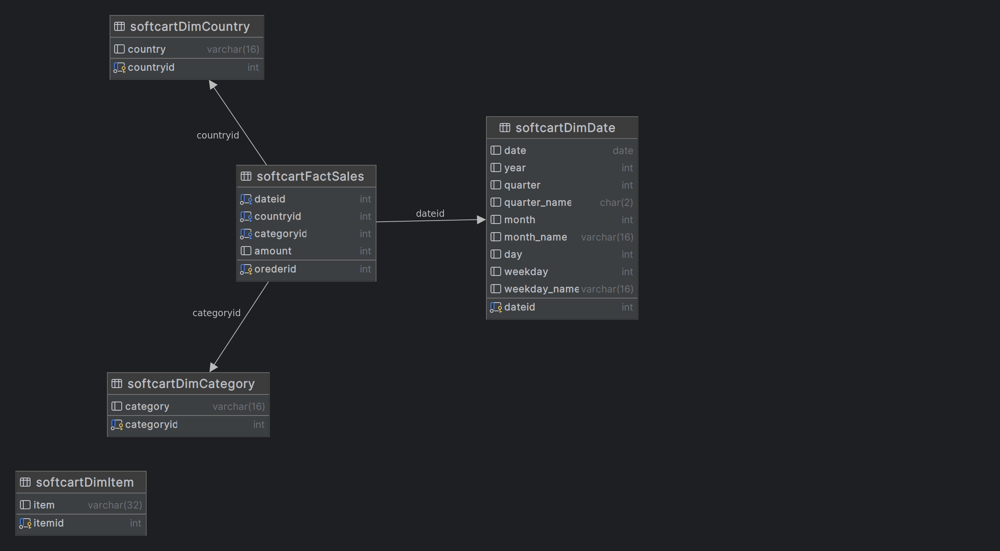

## Project Name
Build a Data Warehouse - Stage 3

## Project Overview
This project is the third stage of a larger project to design a data platform architecture and OLTP database. The objective of this stage is to design and implement a data warehouse using DataGrip ERD design tool, load data into the data warehouse, write aggregation queries, and create a Materialized Query Table (MQT). The project is implemented using MySQL.

## Components
The project consists of the following components:

1. Design a Data Warehouse: In this component, a data warehouse is designed using the DataGrip ERD design tool. The data warehouse is designed to store and analyze sales data including Country information, Category information, and Date information.

2. Load Data into Data Warehouse: In this component, data is loaded into the data warehouse from the CSV files.

3. Write Aggregation Queries: In this component, aggregation queries are written to analyze the data in the data warehouse. The queries include finding the total sales generated by each country, finding the top categories who have got the most sales, and finding the total sales generated by each year.

4. Create Materialized Query Table: In this component, a Materialized Query Table (MQT) is created to improve the performance of the aggregation queries. The MQT stores the results of the queries and allows for faster access to the data.
